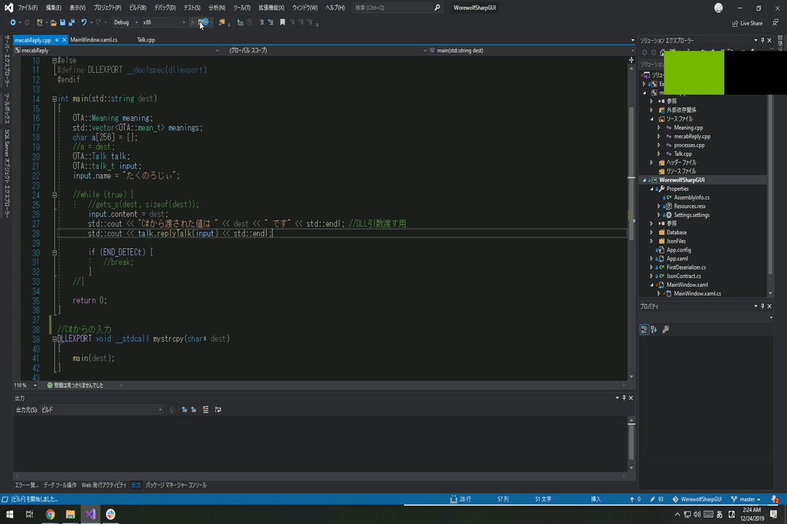

# WerewolfSharpGUI
Werewolf world の Json ファイルデータをGUIで表示するためのツールです。

# 更新状況 (Develop-ver1.5.1)
C#からC++の形態素解析を呼び出して、実行できるようにしました。 

## 実装されている機能

- 会話ログの表示 💬
- 会話の送信（データベースへの保存のみ）👨
- 生存者数の数え上げと表示 👬
- そのフェーズで分かっている役職ボードの表示 🐺
- Jsonldファイルの書き出し 📝 (未完成)
- 形態素解析DLL呼び出し 📞 ← Update!!

"OTA"ボタンが追加されました。 
クリックすると形態素解析に、あらかじめパターン化された Example の文字列を投げます。 
結果としてはコンソール上に表示されます。解析自体は文字化けしていますが、Mecabとの文字コードが異なるのが原因だと思います。文字化けしてても解析出来ているとは思います。最終的な会話が文字化けしていなければそのまま使用しても問題ないかもしれません。

.png "screenshot")

現在のソリューション（プロジェクト）の状態はこんな感じです。 
形態素解析プロジェクトが追加されました。DLLエクスポートの関係上、すこし中身をいじりました。

.png "screenshot")

動かしている様子です。 

## 現時点での問題点

- データベースの更新に伴い、履歴にあったデータの表示が〇から？になってしまう問題
- 配列要素をもつデータ構造のシリアライズで例外が発生する（おそらくNULL）
- 形態素解析 DLL にて CSV が読み込めていない様子...(C#から投げられれば良さそう？)
- プロジェクトが大きくなってきたので、デザインパターンを導入したい（構想中）

 

## デザインパターンを理解できれば...
WerewolfSharp バージョン2 にアップデートするかもしれません。しばらくバージョン1で続けますが...。

[@nyabingo](https://github.com/nyabingo) さんと並行して製作中。

 
takunology (2019/12/24) 更新