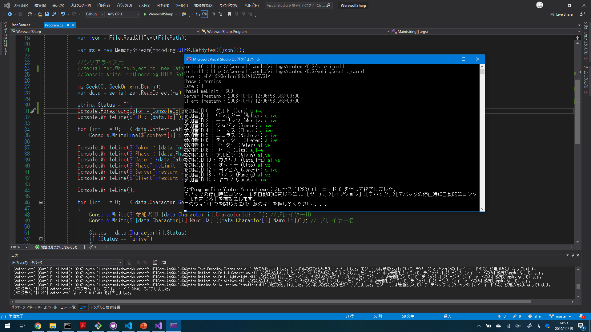

# TMCIT_WereWolf
Develop WereWolf game at TMCIT Program design method class group-2. Source code and Works are manage this repository by group-2 Team.

# WerewolfSharpについて

Server2clientのJsonldファイルをC#で動かして、読み込むことができるコンソールアプリです。動かしてみたい人は .NET Core 3.0 を[インストール](https://dotnet.microsoft.com/download/dotnet-core/3.0)してください。プラットフォームはWindows， Linux， Mac対応です。

JsonData.csはJsonldファイルの読み込んだデータの保管に使用します。JsonldのKeyが各クラスの属性（データコントラクト）の名前空間に対応しています。  

Program.csはJsonldのデシリアライズとエンコードを行い、JsonData.csのメンバ変数に管理されるようになっています。 
現在はタイムスタンプ、参加しているプレイヤーの名前、生存状況の読み込みと表示が行えます。 

   

# Imagesディレクトリについて
   readmeで画像を表示するための画像保管ディレクトリとして作成しました。

 
takunology (2019/11/15) 更新