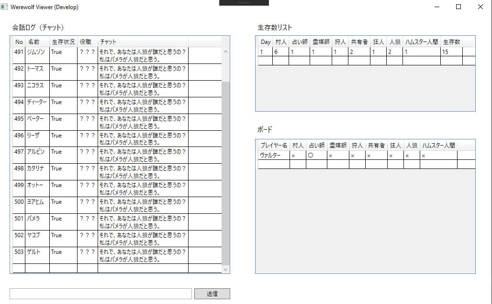
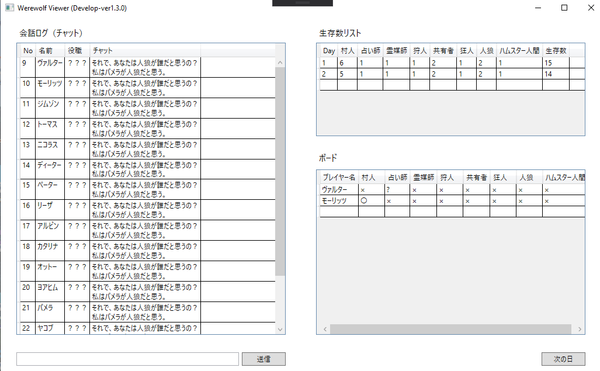

# WereeolfSharpGUI
Werewolf world の Json ファイルデータをGUIで表示するためのツールです。

# 更新状況(Develop-ver1.3.0)
Json で読み込んだプレイヤー情報とゲーム情報を LocalDB に保持して DataGrid で表示できるようにしました。動作環境は .NET Framework 4.7.3 なので Windows で動作します。また、データベースは Microsoft SQL Server 2016 以上を使用しています。

## できること
会話のログ、プレイヤー人数、その日の時点で分かっている役職を表示できるようになりました。

次の日をクリックすると2日目のJsonファイルを読み込みます。3日以降のデータは用意していないので、何度クリックしても2日目のデータがデータベースに蓄積されるだけです。

## 現時点での問題点
データベースの更新に伴い、履歴にあったデータの表示が〇から？になってしまう問題があります。

 
takunology (2019/11/24) 更新