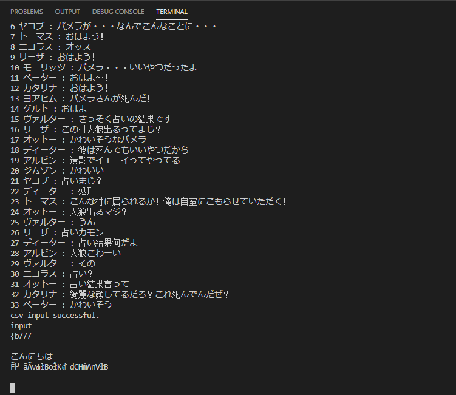

# Werewolf_Py
C#で作っていたら迷子になってしまったため、Pythonで作成することにしました。
思ったよりも作業が進んだのでいい感じです。

# 現状
できること
- Jsonファイルを順番に読み込める
- キャラ名とセリフを配列に保持
- ロボットが会話に割り込むタイミングを乱数で制御
- 形態素解析DLLの読み込み

# 課題
- 形態素解析の文字化け問題の解決
- powershellから入力すると問題なく動作するが、Pythonから引数で文字を入れるとエラーが発生（強制終了）
 
 

takunology (2020/2/4) 更新