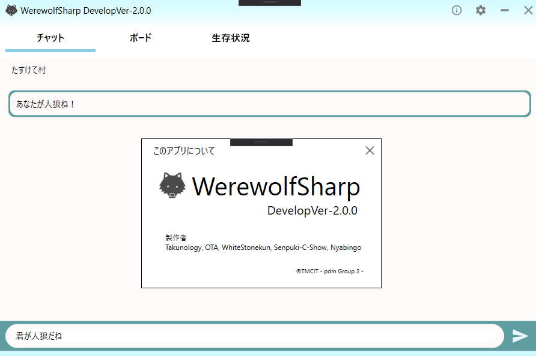

# WerewolfSharpGUI
Werewolf world の Json ファイルデータをGUIで表示するためのツールです。

# 更新状況 (Develop-ver2.0.0)
プロジェクトが肥大化してきたので、MVVMデザインパターンを導入しました。また、デザイン自体も変更しました。 

## 実装されている機能

- Ver1.5.1 で実装された機能を移植中

## アプリ構成
形態素解析は「自動化」の部分で関わっていますが、Modelで処理させるようにします。

## 現時点での問題点

- 移植に時間がかかっています
- データベースの更新に伴い、履歴にあったデータの表示が〇から？になってしまう問題
- 配列要素をもつデータ構造のシリアライズで例外が発生する（おそらくNULL）
- 形態素解析 DLL にて CSV が読み込めていない様子...(C#から投げられれば良さそう？)

 

## 今後の予定
- json ファイルの出力について修正
- DLLから文字列を受け取り、GUIで表示させる（CLIは確認済み）
- Jsonファイルを自動で読み込む（シナリオ通りに進めてみる）

[@nyabingo](https://github.com/nyabingo) さんと製作中。

 
takunology (2020/1/7) 更新